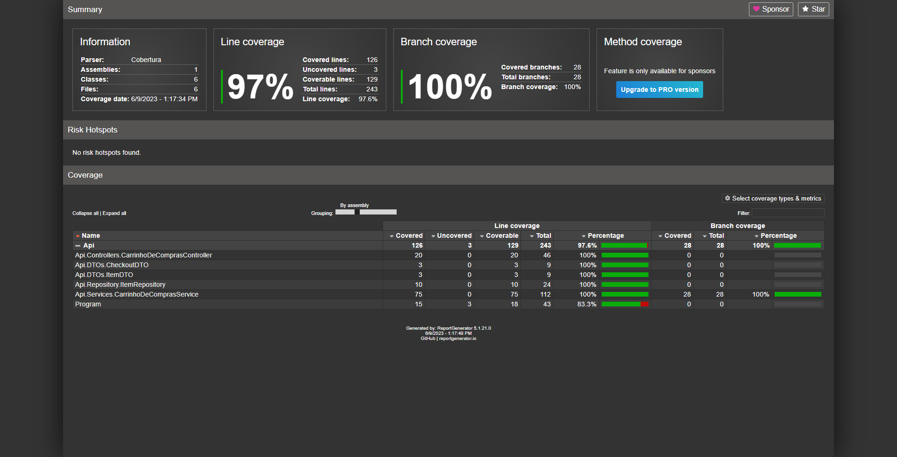

# Atlantic-carrinho-de-compras

## 💻 Sobre o projeto

<p align="justify"> Projeto desenvolvido durante a disciplina IMD0183 - GERÊNCIA DE CONFIGURAÇÃO E TESTE DE SOFTWARE da RESIDÊNCIA EM TECNOLOGIA DA INFORMAÇÃO - TCE/RN/IMD, contendo uma API REST em C# (incluindo camadas de Controller, Service e Repository) que simule o módulo de um Carrinho de Compras, especialmente o método responsável por fazer o checkout, implementando casos de testes executáveis para o método de checkout e um teste que empregue os conceitos de Test Double.
</p>

## 🛠️ Tecnologias Utilizadas

- [.NET 7.0](https://dotnet.microsoft.com/en-us/download/dotnet/7.0)
- Outras tecnologias utilizadas (se aplicável)

## 🔎 Configuração do Ambiente de Desenvolvimento

Será necessário ter instalado em sua máquina o SDK do .NET 7.0 e um editor de código de sua preferência. Caso não tenha siga os passos informados a seguir:

- Para o editor de código você pode utilizar o [Visual Studio Code](https://code.visualstudio.com/download)
- Acesse o [site](https://dotnet.microsoft.com/en-us/download/dotnet/7.0),  para obter o SDK do .NET 7.0
- ```shell

  ```

## ▶️ Como Executar o Projeto

```shell
#Clone o projeto, utilizando o link para o repositório 
git clone https://github.com/humbertovasques/carrinho-de-compras.git
#Inicie o terminal dentro do repositório clonado e utilize o comando dotnet build para carregar as depêndencias
dotnet build
#Acesse a pasta Api dentro do repositorio 
cd .\Api\
#Utilize o comando dotnet run para rodar o projeto
dotnet run
```

## ▶️ Como Executar os Testes

```shell
#Inicie o terminal dentro do repositório clonado e utilize o comando dotnet test para executar os testes
dotnet test
#Alternativamente pode-se instalar a extenção do Visual Studio Code: .Net Core Test Explorer para visualização dos testes
```

## ▶️Como Verificar a Cobertura dos Testes

```shell
#Inicie o terminal dentro do repositório clonado e utilize o comando dotnet test --collect:"XPlat Code Coverage" para gerar um relatorio de testes em .xml na pasta TestResults
dotnet test --collect:"XPlat Code Coverage"
#Execute o comando dotnet tool install -g dotnet-reportgenerator-globaltool para instalar um conversor do relatório em xml para html
dotnet tool install -g dotnet-reportgenerator-globaltool
#Dento da pasta do relatorio em xml gerado execute o comando reportgenerator "-reports:coverage.cobertura.xml" "-targetdir:coverage-report" "-reporttypes:Html" e abra no navegador o html gerado
reportgenerator "-reports:coverage.cobertura.xml" "-targetdir:coverage-report" "-reporttypes:Html"
```



## 🤝 Autores

-[Humberto Vasques](https://github.com/humbertovasques)
-[Jéssica Silva de Souza](https://github.com/jessicadsz)
-[Victor Hugo Duarte do Vale](https://github.com/victorhdv)

## 📜 Licença

 Utilizamos licença [?]()
